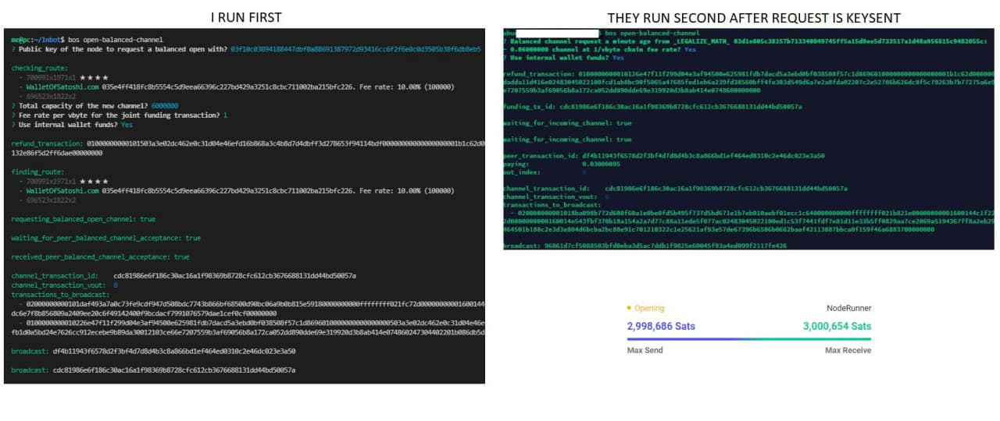

# Balance of Satoshis Commands

**This document helps with BOS Commands:**

Most bos commands follow the following format.
`bos CommandName Argument --Flag` or `bos CommandName --Flag` or `bos CommandName Option --Flag`if a command does not have an argument. 
**Arguments are always mandatory, options and flags are optional.**
   

1. `bos` or `bos --help` or `bos -h`: This brings up the help menu with the list of all BOS Commands
2. `bos --version` or `bos -V`: Shows the current version of BOS
3. `bos help CommandName` or `bos CommandName --help` or `bos CommandName -h`: Displays help section and usage of each command. Example usage `bos help peers`
4. All bos commands can use a node flag that can be used to call any saved node you might have saved in the `~/.bos` directory. If you have multiple nodes you can remotely control your node from bos. Example: `bos peers --node=alice` where alice is the name of your saved node.

  

### **Always double check with `bos commandName -h` before running a command**
  

## Commands List:

1. `bos accounting`: There are 6 different categories for accounting:
- Arguments:
  - `chain-fees`: All on-chain fees paid, example channel opens and closures.
  - `chain-receives`: All onchain payments you receive including any from channel closures.
  - `chain-sends`: Any onchain payments you made.
  - `forwards`: Fees you earned from routing payments
  - `invoices`: any invoices settled
  - `payments`: any payments made on the LN including keysends.
- Usage example: `bos accounting chain-fees`. Displays amounts spent on chain-fees in a table.
- Flags: 
  - `--csv`: outputs the accounting results to a csv file: Example: `bos accounting chain-fees --csv > chainfees.csv`
  - `disable-fiat`: Disables the usage of fiat in accounting, it defaults to sats as the unit or account.
  - `month`: select the month number to get accounting only for that specific month. `bos accounting forwards --month 8` returns results for August.
  - `rate-provider`: BOS provides two rate providers, coindesk and coingecko to provide accounting in fiat, this flag is defaulted to coindesk. To switch provider if the other provider is down or results take too long to pop-up use `bos accounting forwards --rate-provider coingecko`
  - `year`: returns accounting results for a specifc year, it can be used in combination with month or separately to reults for the entire year. `bos accounting payments --month 10 --year 2021`
- Flags can be used together, example: `bos accounting forwards --month 10 --disable-fiat`
  
  

2. `bos balance`: Gives total of on-chain, off-chain, pending and commit fees.
- Flags:
  - `above`: Returns balance above a certain number, `bos balance --above 10000`
  - `below`: Returns balance below a certain number, `bos balance --below 10000`
  - `confirmed`: Returns confirmed balance only. Removes any pending funds.
  - `detailed`: Returns detailed balance, a break down of offchain and onchain
  - `offchain`: Returns offchain balance only, amount on channels.
  - `onchain`: Returns onchain balance only, amount in your LND onchain wallet.
     
  Example: `bos balance --onchain --confirmed`
  
  

3. `bos cert-validity-days`: Returns how many days your certificate is valid.
- Flags: 
  - `below`: returns number of days below a certain number
     
  Example: `bos cert-validity-days --below 10`
  
  

4. `bos chain-deposit`: Generates address and QR code to deposit funds to your onchain wallet.
- Options:
  - `amount`: generate an address to deposit a specific amount. `bos chain-deposit 100000`.
     
  Example: `bos chain-deposit` or `bos chain-deposit 100000`
  
  

5. `bos chainfees`: Gives you an estimate of the chain-fees for various confirmation targets
- Flags:
  - `blocks`: Fees estimate based on block confirmation target
  - `file`: Enter path to a JSON file to write the out of the command to.
     
  Example: `bos chainfees --blocks 10 --file /home/umbrel/blocks.json`
  
  

6. `bos chart-chain-fees`: Gives you a chart and total onchain fees you paid in the last 60 days (default and can be changed)
  - Flags:
    - `days`: Produces a chart for the last number of days specified.
       
  Example: `bos chart-chain-fees --days 90`
    
  

7. `bos chart-fees-earned`: Gives you a chart and total routing fees you earned in the last 60 days (default and can be changed)
  - Options:
    - `pubkey`: Enter the pubkey of for the peer to get the routing fees earned via a specific peer.
  - Flags:
    - `days`: Produces a chart for the last number of days specified.
    - `count`: Give you a count of the number of forwards instead of sats
       
  Example: `bos chart-chain-earned --days 90`
    
  

8. `bos chart-fees-paid`: Gives you a chart and total routing fees you paid in the last 60 days (default and can be changed)
  - Flags:
    - `days`: Produces a chart for the last number of days specified.
    - `most-fees`: Gives a table for fees paid per peer/network and amount forwarded per peer.
    - `network`: Fees paid to the network who are not your peers, example are other hops in a rebalance or payment made.
    - `peer`: Fees paid only to your peers excluding the others in the network
    - `rebalances`: shows only fees paid for rebalances or payments made to yourself
       
  Example: `bos chart-fees-paid --days 15 --rebalances`
    
  

9. `bos chart-payments-received`: Gives you a chart of all payments received on your node like keysends and settled invoices.
  - Flags:
    - `days`: Produces a chart for the last number of days specified.
       
  Example: `bos chart-payments-received --days 15 --rebalances`
    
  

10. `bos closed`: Returns a list of confirmed channel closures.
  - Flags:
    - `limit`: Limits the number of records returned.  
  Example: `bos closed --limit 20`
  
  

11. `bos credentials`: Outputs credentials to access your node. Needs to be used in combination with `bos nodes --add`. Running the command without any flag will ask you a question to enter a pubkey to transfer the credentials in an encrypted way.
  - Flags:
    - `cleartext`: Outputs a cleartext format of macaroon, cert and socket and the credentials expire with default number of days=365
    - `days`: Sets the number of days the credentials produced expire in
    - `readonly`: Outputs credentials that can only be used for read only
    - `nospend`: Outputs credentials that do not let you spend funds on the node
       
  Example: `bos credentials --cleartext --days 200 --readonly`
      
    

12. `bos fees`: Gives a chart of fees rates set per peer. Base fees is not included.
  - Flags:
    - `set-fee-rate`: Lets you set fee rate in ppm
    - `to`: Specify the public key of the peer you want to set fee rate to, multiple public keys can be passed.
       
  Example: `bos fees --set-fee-rate 1000 --to pubkey1 --to pubkey2`
    
  

13. `bos find`: Lets you find something that is stored in the data base, like a transaction, payment information, peer info, channel ID etc.
  - Arguments:
      - Takes differnt kinds arguments:
    Example: `bos find 703539x1305x0` `bos find Bitrefill` `bos find 02816caed43171d3c9854e3b0ab2cf0c42be086ff1bd4005acc2a5f7db70d83774`
    
  

14. `bos forwards`: Outputs a chart of forwards that took place from both inbound and outbound.
  - Flags:
    - `days`: Table view only shows forwards per peer for the last number of days selected
    - `complete`: Shows complete results in a non table format
  
  

15. `bos fund`: Lets you make a signed transaction to an address and a specific amount to spend your onchain funds.
  - Arguments:
    - `address`: Enter the address you're funding.
    - `amount`: Enter the amount you're funding.
  - Flags:
    - `dryrun`: Does a dryrun and prevents your funds (UTXOs) from getting locked.
    - `utxo`: Enter a specific tx_id:vout that you want to use to fund.
    - `select-utxos`: Opens an interactive view to select your spendable UTXOs, use "Space" to select a UTXO and hit "Enter" when done.
       
  Example: `bos fund addressToFund amountToFund --select-utxos`
    
  

16. `bos gateway`: Stars a LND gateway server on a port that listens to WebUI Access. Connection code has a specific expiry time.
  - Flags:
    - `port`: Starts lisening on a specified port
    - `remote`:  Enter a URL to generate a connection code for a remotegate way that expires at a specific time.
      
  

17. `bos graph`: Returns a list of connections and other public information of a node.
  - Arguments:
    - Takes `pubkey` or `alias` as an option to return output.
  - Flags:
    - `filter`: Set a filter to filter returned results, example `--filter CAPACITY>1000000` returns channels with peers greater than 1M capacity.
    - `sort`: Sorts the rows in the table by the column specified. example `--sort out_fee`
       
  Example: `bos graph Bitrefill --sort in_fee` 
  
  

18. `bos inbound-channel-rules`: Sets rules for other peers to open channels to you. It takes formulas as the as the rule.
  - Flags:
    - `rule`: Select the rule you want to set, examples are `CAPACITY>5000000` to only allow inbound channels of more than 5M capacity. `CAPACITIES>100*M` to only allow an inbound channel if the peer has a total of 1BTC capacity of all public channels put together. Other examples include `PUBLIC_KEY`, `CHANNEL_AGES`, `FEE_RATES` etc.
    - `reason` sends back a reason message when rejecting an inbound channel.
       
  Example: `bos inbound-channel-rules --rule CAPACITY>5000000 --message "Will only accept a minimum 5M inbound channel"`
  
  

19. `bos inbound-liquidity`: Returns your total inbound liquidity you currently have
  - Flags:
    - `above` returns tokens above a number you specify
    - `below` returns tokens below a number you specify
    - `min-score` set a minimum fee rate filter
    - `max-fee-rate` set a maximum fee rate filter
    - `top` returns liquidity in the top percentile for an individual channel
  
  

20. `bos increase-inbound-liquidity`: Helps increase your inbound liquidity by doing a loop out.
  - Flags:
    - `address`: you can specify an external address to send the looped out onchain funds to
    - `api-key`: specify a prepaid API key to use
    - `avoid`: avoid certain pubkeys or channels IDs while taking the path to LOOP. You can use this with `bos tags` and set an avoid tag
    - `confs`: Number of onchain confirmations to consider you have received the funds successfully, defaulted to 1
    - `dryrun`: Does not actually loop out but can give you an estimation of how much amount can be looped out and how much it would cost in offchain fees
    - `fast`: Request LOOP server to avoid batching your onchain transaction
    - `amount`: amount you want to increase inbound liquidity by
    - `max-fee`: max fees you're willing to pay in total for the swap
    - `recover`: you can use the recovery key provided by bos to recover funds in an inprogress swap
    - `with`: specify the pubkey of the peer you want to increase inbound liquidity for
  
  

21. `bos increase-outbound-liquidity`: Opens a new channel to increase your outbound liquidity. If you don't specify `with` flag, BOS chooses a peer for you to open a channel to.
  - Flags:
    - `amount`: amount to increase liquidity
    - `fee-rate`: set channel open fee rate (sats/vByte)
    - `private`: opens a private channel
    - `with`: enter the pubkey to open channel with
    - `dryrun`: avoids opening the channel but gives you a summary of the channel open
  
  

22. `bos outbound-liquidity`: Returns your total outbound liquidity you currently have
  - Flags:
    - `above`: returns tokens above a number you specify
    - `below`: returns tokens below a number you specify
    - `min-score`: set a minimum fee rate filter
    - `max-fee-rate`: set a maximum fee rate filter
    - `top`: returns liquidity in the top percentile for an individual channel
    - `with`: specify the pubkey of a peer to return liquidity with that peer.
  
  

23. `bos nodes`: Adds a saved node to for you to control remotely
  - Options: 
    - `nodeName`: Enter the name of the node, new or existing
  - Flags:
    - `add`: will add a new saved node, will ask you a series of questions to fill out.
    - `remove`: removes an existing saved node
    - `unlock`: removes encryption on the macaroon of a saved node
    - `lock`: encrypt a saved node using a GPG key
  
  

24. `bos open`: Helps to open channels to the network, batch opening and funding from external/cold wallet is supported. **IF USING EXTERNAL WALLET, DO NOT BROADCAST THE TRANSACTION FROM THE EXTERNAL WALLET, BOS WILL DO IT FOR YOU**
  - Arguments:
    `pubkey`: public key of the node you want to open a channel to. Can enter multiple with a space in between.
  - Flags:
    - `amount`: capacity of the channel in Sats you want to open, can specify a separate amount if batch opening channels, default 5M sats if not specified
    - `external-funding`: give you an address for you to sign from your external wallet along with the amount. **IF USING EXTERNAL WALLET, DO NOT BROADCAST THE TRANSACTION FROM THE EXTERNAL WALLET, BOS WILL DO IT FOR YOU**
    - `set-fee-rate`: waits until the channel is open and attempts to set a forwarding fee rate, this process needs to run in the background until a channel is open. Have to run in background process manager like tmux, nohup or keep the ssh session open
    - `type`: public/private, defaulted to public
       
  Example: `bos open pubkey1 --amount 1000000 pubkey2 --amount 3000000 pubkey3 --amount 4000000`. Once you enter the command and hit enter, it will ask the onchain transaction fee you want to set and also if you want to use your internal LND wallet for funding the transaction.
  
  

25. `bos open-balanced-channel`: Lets you open a balanced channel with your peer, both peers involved need to have keysend turned on. Funding from external/cold wallet is supported. **IF USING EXTERNAL WALLET, DO NOT BROADCAST THE TRANSACTION FROM THE EXTERNAL WALLET, BOS WILL DO IT FOR YOU**
  - Flags:
    - `recover`: Enter the address if funds were accidentally sent to it.
      
  Simple running the command `bos open-balanced-channel` will ask you a series of questions to enter, like the `pubkey`, `total capacity` of the channel and the funding `fee rate`. It then key sends all that information to your peer to fund the other half for the channel. Your peer needs to run the same command to accept the request and review all information and agree to it, then the 1st peer or initiator will broadcast the transaction.
    
  
    
  

26. `bos outbound-liquidity`: Returns your total inbound liquidity you currently have
  - Flags:
    - `above` returns tokens above a number you specify
    - `below` returns tokens below a number you specify
    - `with` with a specific peer public key
    - `top` returns liquidity in the top percentile for an individual channel
  
  

27. `bos pay`: This command is used to pay a payment request (Invoice)
  - Arguments:
    - `request`: Enter the invoice you want to pay
  - Flags:
    - `avoid`: When paying the payment request you can set to avoid a node by entering a public key or a specific channel by entering a channel ID. You can also avoid multiple nodes/channels by using the avoid flag multiple times. You can also use a `tag` (more on this in a separate command below) to avoid a group of nodes or channels by grouping them together.
    - `out`: Pay the payment request out from a specifc peer of yours so the first hop is through that peer.
    - `in`: Enter a pubkeyif you want the last hop to be through a specific in peer of the destination node.
    Note: If you create an invoice yourself, and you pay it using an out peer and an in peer of yours, it becomes a command that can you do rebalance with.
    - `message`: Enter a message of your choice to be attached to the payment request
    - `max-fee`: Max total routing fees you're willing to pay in order to pay the payment req. Default: 1337
    - `max-paths`: You can use multi path payments to pay the payment req via multiple paths, bos splits the payment and sends it out. Default: 1
      
    Example: `bos pay invoiceToBePaid --avoid 03f10c03894188447dbf0a88691387972d93416cc6f2f6e0c0d3505b38f6db8eb5 --avoid bannedNodes --out 02c91d6aa51aa940608b497b6beebcb1aec05be3c47704b682b3889424679ca490 --avoid bannedNodes --max-fee 100`
       
    Here `bannedNodes` is an example tagname.
  
  

28. `bos peers`: Lists your current peers that you have channels with in a table view.
  - Flags:
    - `active`: Shows all your active peers (not offline)
    - `complete`: Outputs a detailed view and does not use the table view.
    - `fee-days`: If you enter the number of days, it shows the peers you have earned fees with over N number of days along with the fees earned in a separate column
    - `filter`: You can apply filter formulas to display results, filter takes the column names as the filters, they include AGE, INBOUND_LIQUIDITY, OUTBOUND_LIQUIDITY. You can use filters like this `OUTBOUND_LIQUIDITY>100000` and it will filter results accordingly. You can also formula expressions like `m` for million and `k` for 100k, example `OUTBOUND_LIQUIDITY<1*m`
    - `idle-days`: If you enter the number of days, it shows the peers you had no activity over N number of days, it includes both routing and payments received
    - `inbound-below`: shows peers only below a certain inbound liquidity number
    - `outbound-below`: shows peers only below a certain outbound liquidity number
    - `omit`: enter a public key to omit that peer from the list
    - `private`: shows peers you have private channels with
    - `public`: shows peers you have public channels with
    - `sort`: you can sort by column name, example: `sort OUTBOUND_LIQUIDITY`
    - `tag`: show peers that you have added to your tag, more on this in another command called `bos tags` below.
          
    Example: `bos peers --active --filter OUTBOUND_LIQUIDITY>5*M --idle days 10`
  
  

29. `bos price`: Shows the current price of Bitcoin from the rate provider coindesk (default)
  - Options:
    - `symbols`: You can use currency ticker symbols to get the price in the fiat currency of your choice. Example: `bos price AUD` for Australian Dollar, `GBP` for British Pound, its defaulted to `USD`
  - Flags:
    - `file`: Enter the path to a JSON file to write the output to a file
    - `from`: You can change the rate provider from coindesk (default) to coingecko
          
  Example: `bos price GBP --from coingecko` or just `bos price` for USD and from coindesk
  
  

30. `bos probe`: Simulate a payment of a certain amount will go through using specific conditions, probing sends junk HTLCs to check if a real payment can go though. Can be used to check rebalance routes as well or check the approximate liquidity available on a node via a particular channel.
  - Arguments:
    - `pubkey`: Enter the destination pubkey you want to probe, can be yours as well if you want to probe yourself for a rebalance.
  - Options:
    - `amount`: Amount you want to probe for
  - Flags:
     - `avoid`: When probing you can set to avoid a node by entering a public key or a specific channel by entering a channel ID. You can also avoid multiple nodes/channels by using the avoid flag multiple times. You can also use a `tag` (more on this in a separate command below) to avoid a group of nodes or channels by grouping them together.
    - `out`: Probe out from a specifc peer of yours so the first hop is through that peer.
    - `in`: Enter a pubkey if you want the last hop to be through a specific in peer of the destination node.
    Note: If you enter your pubkey, and you probe it using an out peer and an in peer of yours, it becomes a command that can you simulate a rebalance with.
    - `find-max`: Find the maximum amount you can route when you simulate a payment
        
  Example: `bos probe 03f10c03894188447dbf0a88691387972d93416cc6f2f6e0c0d3505b38f6db8eb5 3000000 --out 02c91d6aa51aa940608b497b6beebcb1aec05be3c47704b682b3889424679ca490 --avoid crapNodes`
  
  

31. `bos rebalance`: Rebalancing your channels by moving liquidity between your peers. A rebalance moves local funds from one peer to another peer of yours which helps in gaining inbound liquidity in the channel the funds are leaving and gaining outbound liquidity in the channel the funds are arriving.
  - Flags:
    - `amount`: The maximum amount you want to rebalance
    - `out`: this flag can take the pubkey or Alias of your peer, its the first hop where you want the funds to leave from.
    - `in`: this flag can take the pubkey or Alias of your peer, its the last hop where the funds arrive into.
    - `avoid`: this can take pubkey, channel ID or a `bos tag` where you can group multiple pubkeys to avoid while doing a rebalance. Avoid can take filters as well, explained in example below.
    - `in-target-outbound`: the amount of outbound you want to target for the peer where the funds are coming into.
    - `out-target-inbound`: the amount of inbound you want to target for the peer through which the funds are going out of.
    - `max-fee-rate`: the maximum fee rate in ppm that you want to pay for your rebalance
    - `max-fee`: the maximum total fees in sats that you want to pay for your rebalance
    - `minutes`: the maximum time you want the rebalance to run if it does not succeed or fail within the time you specified. The command will time-out after N number of minutes you specify.
    - `in-filter`: the set of in-peers you want the rebalance to filter through, this option is used with tags.
    - `out-filter`: the set of out-peers you want the rebalance to filter through, this option is used with tags.
      
  Example: ` bos rebalance --out "WalletOfSatoshi.com" --in "EDON" --out-target-inbound=capacity*0.85 --max-fee-rate 700 --max-fee 2000 --minutes 20 --avoid ban --avoid "035e4ff418fc8b5554c5d9eea66396c227bd429a3251c8cbc711002ba215bfc226/OR(FEE_RATE<80 , FEE_RATE>500)" 
--avoid "035e4ff418fc8b5554c5d9eea66396c227bd429a3251c8cbc711002ba215bfc226/HEIGHT<600000" --avoid "035e4ff418fc8b5554c5d9eea66396c227bd429a3251c8cbc711002ba215bfc226/opposite_fee_rate<100" --avoid "fee_rate<50/0296b46141cd8baf13f3eff9bb217c5f62ce0a871886559d661af0ef422c042d4b"`
  
- **Breaking down this example:**
    - `--out "WalletOfSatoshi.com"` is the peer where funds local funds move out from so it's the peer you want to gain inbound.
    - `-- in "EDON" is the peer where funds leaving from the WalletOfSatoshi.com channel are coming into and local balance is increased or outbound is gained.
    - `--out-target-inbound=capacity*0.85` This flag indicates that you want the channel with WalletOfSatoshi.com to have inbound of 85% of the total channel capacity, for example, if you have a 1M channel with WoS, you're targetting 850K of inbound. If you want a 50-50 channel with WoS, it would be `--out-target-inbound=capacity*0.5` OR `--out-target-inbound=capacity/2`
    - `--max-fee-rate 700` is the maximum fee rate in ppm you're willing to pay for the total rebalance
    - `--max-fee 2000` is the total maxmimum fee in sats you're willing to pay for the rebalance including base fee.   
    **Note: Specify both values during a rebalance, the rebalance will fail if it finds a route and does not satisfy one of the criterias**
    - `--minutes 20` the rebalance will time out after 20 miniutes of path finding, the time-out occurs if the rebalance does not succeed/fail within the specified time.
    - `--avoid ban` "ban" is the name of the tag that I created, a tag can be named anything of your choice and you can add multiple pubkeys to the tag to categorize nodes. In this example, nodes specified in the tag "ban" will be avoided during path finding. 
  - **Avoid Filters:**
    - avoid flag can take filter formulas along with a pubkey to filter channels of the pubkey during path finding. 
    - Syntax: `--avoid pubkey/forumla`: If the syntax is pubkey followed by formula, the filter applies to channels of the node specified in the outbound direction.
    - Syntax: `--avoid formula/pubkey`: If the syntax is formula followed by pubkey, the filter applies to channels of the node specified in the inbound direction.
  - **Example Breakdown Continued:**
    - `--avoid "035e4ff418fc8b5554c5d9eea66396c227bd429a3251c8cbc711002ba215bfc226/OR(FEE_RATE<80 , FEE_RATE>500)"`, the pubkey specified in the filter belongs to WalletOfSatoshi.com, this formula implies you want to avoid all channels of WalletOfSatoshi that they charge less than 80ppm or greater than 500ppm. For example, if you just want to avoid a peer's channels greater than 200ppm the syntax is: `--avoid "pubkey/FEE_RATE>200)`
    - `--avoid "035e4ff418fc8b5554c5d9eea66396c227bd429a3251c8cbc711002ba215bfc226/HEIGHT<680000"` the pubkey specified in the filter belongs to WalletOfSatoshi.com, this formula implies you want to avoid all channels of WalletOfSatoshi that were created before the block height of 600000, this block was mined on `2021-04-21 05:58` which implies you want to avoid all your WalletOfSatoshi's channels that were created before that date. The theory behind this could be, all old channels might not be well maintained and might not have liquidity in the direction you want.
    - `--avoid "035e4ff418fc8b5554c5d9eea66396c227bd429a3251c8cbc711002ba215bfc226/opposite_fee_rate<100"` the pubkey specified in the filter belongs to WalletOfSatoshi.com, this formula implies you want avoid all channels of WalletOfSatoshi.com where the opposite_fee_rate is less than 100 or the rate which WalletOfSatoshi's peers charge them to route in the opposite direction, this is the fee rate that does NOT apply to you in the path finding because its in the opposite direction. The purpose of this filter is, a lot of nodes today are using dynamic fee rates to indicate to the network the direction in which they have liquidity using tools like charge-lnd. In the formula, by specifying you want to avoid low fee rates in the opposite direction you're effectively saying you want to avoid channels of WoS that are charging low because the liquidity is on the side of WoS's peers which is not the direction you need it for your rebalance to succeed. If the fee is high in the opposite direction an assumption can be made that liquidity is on WoS's side which is favorable for the success of your rebalance.
  - **Example of inbound 2nd syntax:**
    - `--avoid "fee_rate<50/0296b46141cd8baf13f3eff9bb217c5f62ce0a871886559d661af0ef422c042d4b"` the pubkey specified in the filter belongs to EDON, this formula implies you want avoid all channels of coming into EDON that charge less than 50 ppm.
    - Similar inbound syntax can be applied to all other filters mentioned above.
      
    **Note: Avoid formulas can be applied to any node in the graph, it is not limited to just your peers, you can replace the public key with any public key of your choice.**
  - **Using --out-filter and --in-filter**
    - If you create tags for your peers (check the tags command on how to create tags), you can use them for rebalances. instead of specifying `--out` and `--in` peer you can specify a group of nodes you want and bos can pick from those nodes to do rebalances with. Usage: `bos rebalance --out-filter outTagName --in-filter inTagName --out-target-inbound=capacity*0.85 --max-fee-rate 700 --max-fee 2000 --minutes 20 --avoid ban`
  
  

32. `bos reconnect`: This command attempts to reconnect any disconnected peers, channels that are inactive are also treated as disconnected. DO NOT use this command with the `--node` flag.  
  Example: `bos reconnect`, you can set to run a reconnect automatically in a cronjob like this: `*/300 * * * * /home/ubuntu/.npm-global/bin/bos reconnect`, this runs the command every 5 hours. Adjust your path according to where bos is installed on your node.
  
  

33. `bos remove-peer`: Closes a channel with a connected peer.
  - Options:
    - `public key`: Enter the public key of the peer you want to close the channel with.
  - Flags:
    - `active`: Makes sure the peer is online before closing the channel to ensure a coop close.
    - `address`: if you want to send funds that you get back (your local balance) straight to an external wallet, enter the destination address.
    - `fee-rate`: Set the fee rate for the closure.
    - `force`: Force close channel with a peer
    - `inbound-below`: close channels with peers below a certain inbound liquidity level
    - `outbound-below`: close channels with peers whose outbound is below a certain number
    - `omit`: omit a peer you don't want to close a channel with if they fall under filter criteria of other flags such as `inbound-below`
    - `outpoint`: if you have multiple channels with the same peer, use this flag to only close one specific channel using `txid:vout`, you can get this value from `lncli listchannels`
    - `private`: make sure you have a private channel with the peer
    - `public`: make sure you have a public channel with the peer
    - `offline`: check if the peer is offline
      
  Example: `bos remove-peer  pubkeyOfYourPeer --fee-rate 1 --force`
  
  

34. `bos send`: This command is used to make a keysend payment using a node's pubkey.
  - Arguments:
    - `pubkey`: Enter the pubkey of the node you want to make a payment to.
  - Flags:
    - `avoid`: When paying the payment request you can set to avoid a node by entering a public key or a specific channel by entering a channel ID. You can also avoid multiple nodes/channels by using the avoid flag multiple times. You can also use a `tag` (more on this in a separate command below) to avoid a group of nodes or channels by grouping them together.
    - `out`: Keysend out from a specifc peer of yours so the first hop is through that peer.
    - `in`: Enter a pubkey if you want the last hop to be through a specific in peer of the destination node.
    Note: If you enter your own pubkey, you can keysend using an out peer and an in peer of yours, it becomes a command that can you do rebalance with. Useful for rebalances below 50k sats since `bos rebalance` does not support rebalances below 50k sats.
    - `message`: Enter a message of your choice to be attached to the keysend
    - `max-fee`: Max total routing fees you're willing to pay in order to pay the payment req. Default: 1337
    - `max-paths`: You can use multi path payments to pay the payment req via multiple paths, bos splits the payment and sends it out. Default: 1
    - `message-omit-from-key`: BOS by default adds your pubkey to the keysend message, you can add this flag to avoid it.
      
    Example: `bos send pubKeytoPay --avoid 03f10c03894188447dbf0a88691387972d93416cc6f2f6e0c0d3505b38f6db8eb5 --avoid bannedNodes --out 02c91d6aa51aa940608b497b6beebcb1aec05be3c47704b682b3889424679ca490 --avoid bannedNodes --max-fee 100`
       
    Here `bannedNodes` is an example tagname.
  
  

35. `bos tags`: This commands allows you to create custom tags to categorize your peers. You can create a tag name of your choice and add pubkeys of nodes to the tags.
  - Options:
    - `tagname`: Enter a tagname you want to create or an existing tag that you already have.
  - Flags:
    - `add`: add a public key to a tag
    - `remove`: remove a public key from a tag
    - `icon`: you can add an emoji to your tag
    
  Example: `bos tags bannedNodes --add 03c2abfa93eacec04721c019644584424aab2ba4dff3ac9bdab4e9c97007491dda`.
  Simply running `bos tags` will display all your tags. Tags are stored in `~/.bos` folder, you can also edit your tags by editing the `tags.json` file.

36. `bos utxos`: Returns a list of your UTXOS.
  - Flags:
    - `confirmed`: returns only confirmed utxos.
    - `count`: returns the number of utxos you have available in pending and confirmed
    - `count-below`: returns a utxos count number below the number you specified
    - `size`: returns utxos greater than the specified amount
    
  Example: `bos utxos` or `bos utxos --confirmed --count`
